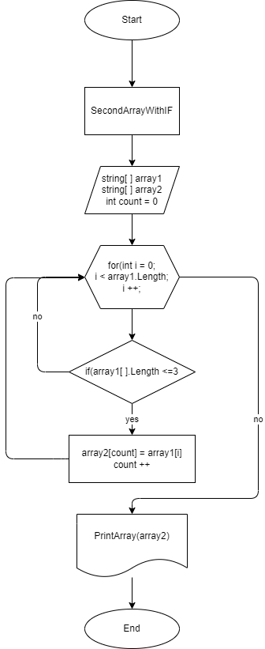

# FINALWORK

## Задача:
### Написать программу, которая из имеющегося массива строк формирует массив из строк, длина которых меньше либо равна 3 символа. Первоначальный массив можно ввести с клавиатуры, либо задать на старте выполнения алгоритма. При решении не рекомендуется пользоваться коллекциями, лучше обойтись исключительно массивами.

## Алгоритм:
### Сначала объявляю два массива одинаковой длины. Затем формирую безвозвратный метод, в котором цикл соизмеряется с длиной массива, соответствующий условию (<=3) и, если соответствует, то элемент первого массива заносится в count элемент второго массива. Переменная count используется для поочерёдного закидывания элементов из первого массива во второй без пробелов. Далее count увеличиваем на единицу и с помощью цикла for увеличиваем i на единицу. Так перебираем до завершения и выводим результат.

## Блок-схема:
### Представляю графическое изображение алгоритма.

## Gitignore-файл:
### С помощью этого файла удаляю ненужную информацию.
